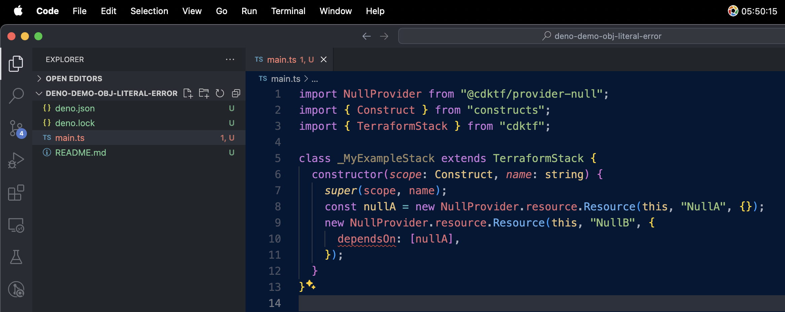

# Demonstrate Change to Deno Syntax Validation

## Resolved in Deno v1.45.0 ✅

We've discovered a destructive change in how typescript code is validated in
[deno](https://github.com/denoland/deno).

The change appears to have been introduced in deno version
[1.44.3](https://github.com/denoland/deno/releases/tag/v1.44.3) and is not
present in version
[1.44.2](https://github.com/denoland/deno/releases/tag/v1.44.2).

The error is presented as shown in this screenshot in Deno version 1.44.3:



## instructions

To reproduce the issue

1. Quit all running instances of VSCode

2. Install Deno [1.44.3](https://github.com/denoland/deno/releases/tag/v1.44.3)

   ```bash
   deno upgrade --version 1.44.3
   ```

3. Open the [main.ts](./main.ts) file in VSCode and notice that the `dependsOn`
   property is marked as invalid.

4. Install Deno [1.44.2](https://github.com/denoland/deno/releases/tag/v1.44.2)

   ```bash
   deno upgrade --version 1.44.2
   ```

5. Quit all running instances of VSCode

6. Open the [main.ts](./main.ts) file in VSCode and notice that the `dependsOn`
   property is not marked as invalid.
